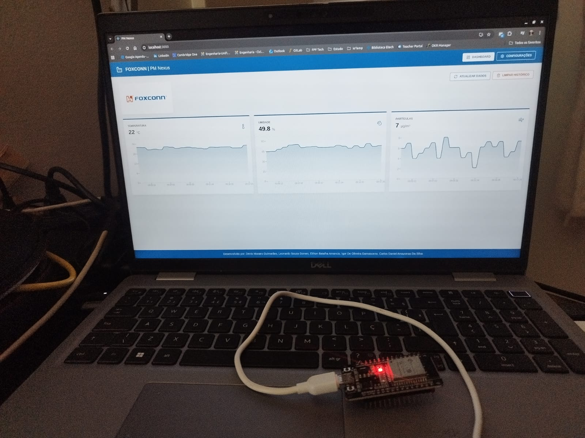
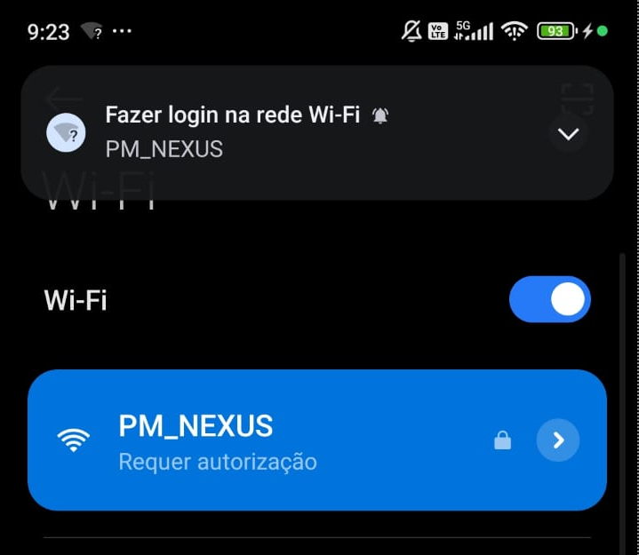
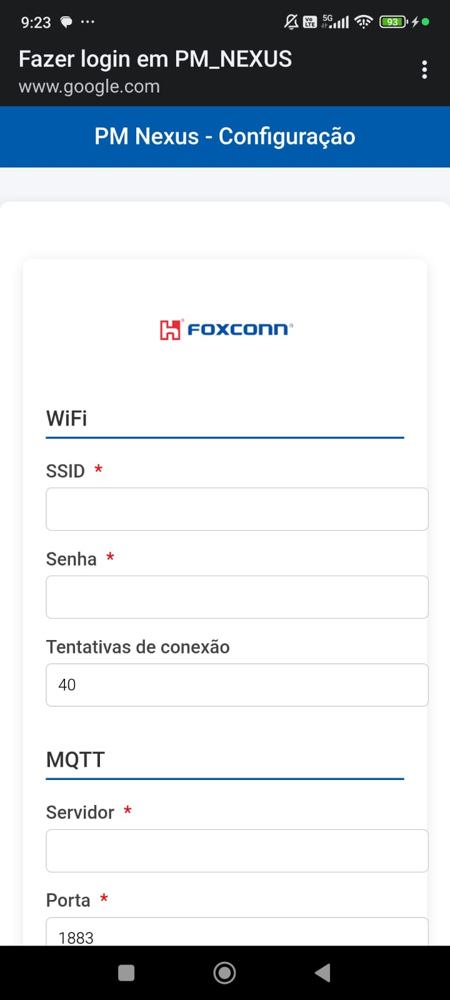
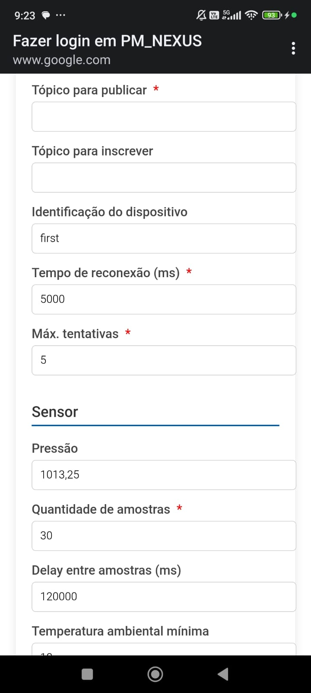
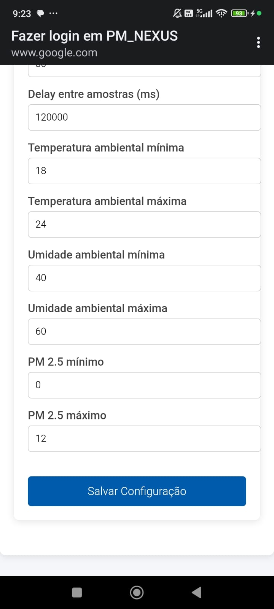
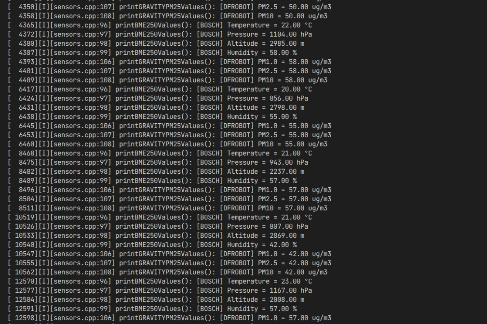
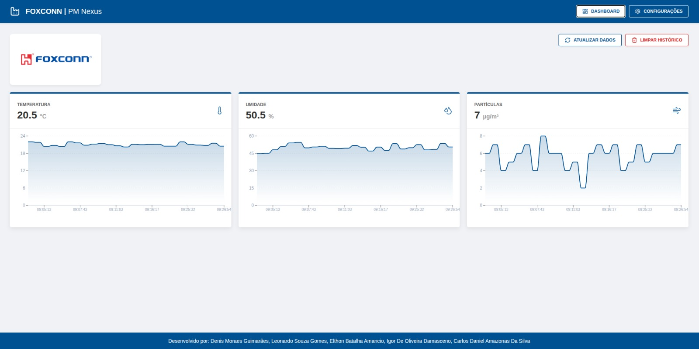
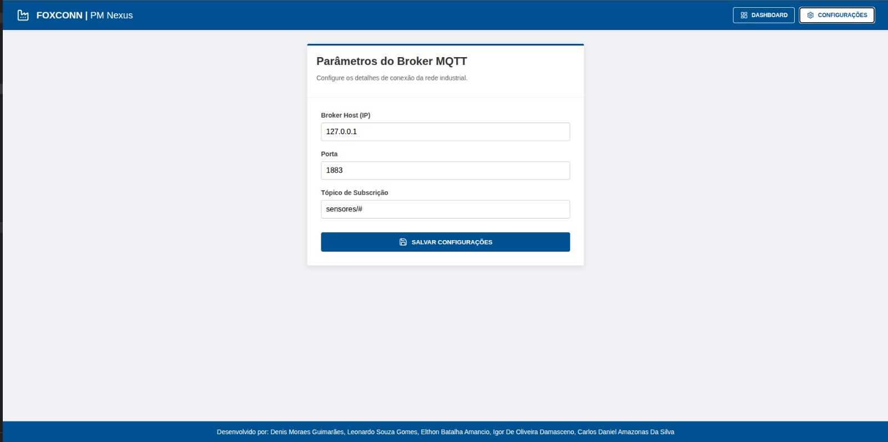

# PM Nexus

Solução de hardware com ESP32 e aplicação web para monitoramento de sensores.

---

## 📷 Hardware

    

---

## ⚙️ Configuração

### 1. Conexão com o dispositivo

Conecte-se à rede Wi-Fi do dispositivo:

- **SSID:** PM_NEXUS  
- **Senha:** 20802080  

    

---

### 2. Configuração inicial

Acesse a interface web e preencha os parâmetros:

    

    

    

---

### 3. Coleta de dados

Após a configuração, os sensores começam a enviar dados automaticamente.

    

---

### 4. Dashboard

Os dados são exibidos em tempo real no dashboard:

    

---

### 5. Configuração do broker MQTT

Também é possível alterar as configurações do broker MQTT:

    

